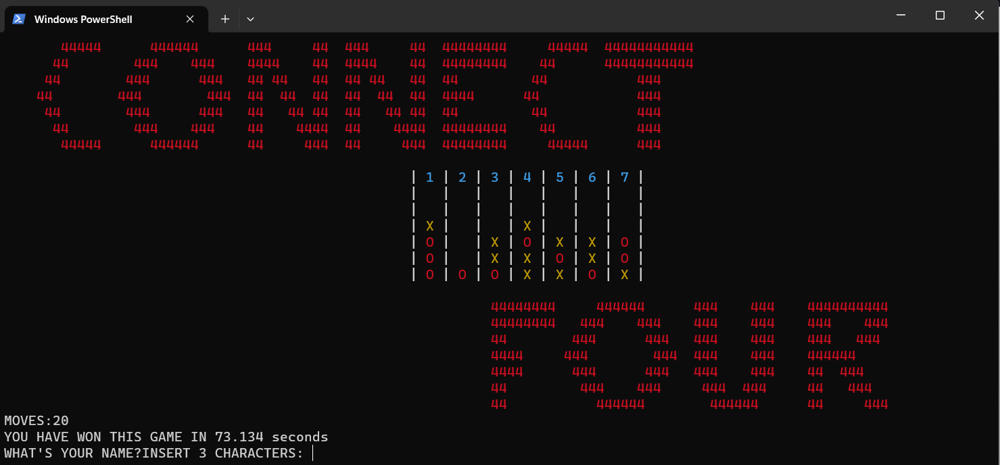

<br/>

<p align="center">
  <a href="https://github.com/rain-ho/connect4-game">
    
  </a>
  <h3 align="center">Connect 4 Game
</h3>

  <p align="center">
    Connect 4: An object-oriented game with linked lists, files &amp; classes.
    <br/>
    <br/>
    <a href="https://github.com/rain-ho/connect4-game"><strong>Explore the docs »</strong></a>
    <br/>
    <br/>
    <a href="https://github.com/rain-ho/connect4-game">View Demo</a>
    .
    <a href="https://github.com/rain-ho/connect4-game/issues">Report Bug</a>
    .
    <a href="https://github.com/rain-ho/connect4-game/issues">Request Feature</a>
  </p>
</p>


## Table Of Contents

* [About the Project](#about-the-project)
* [Getting Started](#getting-started)
  * [Prerequisites](#prerequisites)
  * [Installation](#installation)
* [Usage](#usage)
  * [Game Controls](#game-controls)
* [Contributing](#contributing)
* [Authors](#authors)
* [Acknowledgements](#acknowledgements)

## About The Project


Connect 4 is a fun and challenging game that was created for an object-oriented class, showcasing the implementation of linked lists, files, and classes. Some parts of the code were adapted from Connect4 Game Solver, originally developed by Pascal Pons <contact@gamesolver.org>, and available at <http://connect4.gamesolver.org>.

The game offers a classic and engaging experience, allowing players to drop colored discs (usually red and yellow) into a vertically suspended grid. The objective is to be the first player to connect four discs of the same color in a row, either horizontally, vertically, or diagonally, while preventing the opponent from doing the same.

The use of object-oriented principles in the code makes it modular and easy to maintain. Players can enjoy the game at four different difficulty levels, each offering its unique challenge. The computer AI presents strategic gameplay, providing an exciting and rewarding experience for players of all ages.

Connect 4 demonstrates the power of object-oriented programming, where linked lists, file handling, and classes come together to create an enjoyable and interactive gaming experience.


## Getting Started

To enjoy this game, simply download the .exe file and run it. Please note that the game will generate text files to store game information, so it's advisable to place the .exe file in its own folder for organization

### Prerequisites

You must have a C++ compiler.

### Installation

1. You must have a C++ compiler. If you don't have any you can download [TDM-GCC](https://jmeubank.github.io/tdm-gcc/articles/2021-05/10.3.0-release)

2. Clone the repo
```sh
git clone https://github.com/your_username_/Project-Name.git
```

3. Make your changes and compile by using 
```sh
make
```

## Usage

Here are the main instructions:

1.Choose an operation mode by pressing a number from [0-4].
2.If starting a new game, select a difficulty level or the multiplayer mode.
3.If returning to a previous game, continue playing right where you left off.
4.Alternatively, click any button to proceed.

## Game Controls
When playing, use the following controls:
1.Press any number in [1-7] to place your piece in the corresponding column.
2.Press 0 to undo one or more moves if needed.
3.Press 9 to redo previously deleted moves.

## Contributing

Contributions are what make the open source community such an amazing place to be learn, inspire, and create. Any contributions you make are **greatly appreciated**.
* If you have suggestions for adding or removing projects, feel free to [open an issue](https://github.com/rain-ho/connect4-game/issues/new) to discuss it, or directly create a pull request after you edit the *README.md* file with necessary changes.
* Please make sure you check your spelling and grammar.
* Create individual PR for each suggestion.
* Please also read through the [Code Of Conduct](https://github.com/rain-ho/connect4-game/blob/main/CODE_OF_CONDUCT.md) before posting your first idea as well.

### Creating A Pull Request

1. Fork the Project
2. Create your Feature Branch
```sh
git checkout -b feature/AmazingFeature
```
3. Commit your Changes
```sh
git commit -m "Added some AmazingFeature" -m "This is the AmazingFeature Description"
```
4. Push to the Branch
```sh
git push origin feature/AmazingFeature
```
5. Open a Pull Request

## Authors

* **Rafa** - *Computer Science Student* - [Rafa](https://github.com/rain-ho/) 
* **Casca** - *Computer Science Student* 
  
## Acknowledgements

* [Connect4 Game Solver](http://connect4.gamesolver.org)

